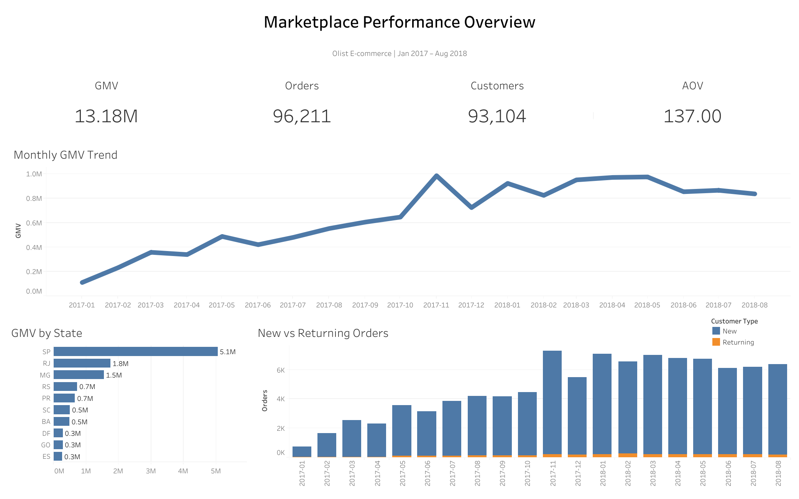
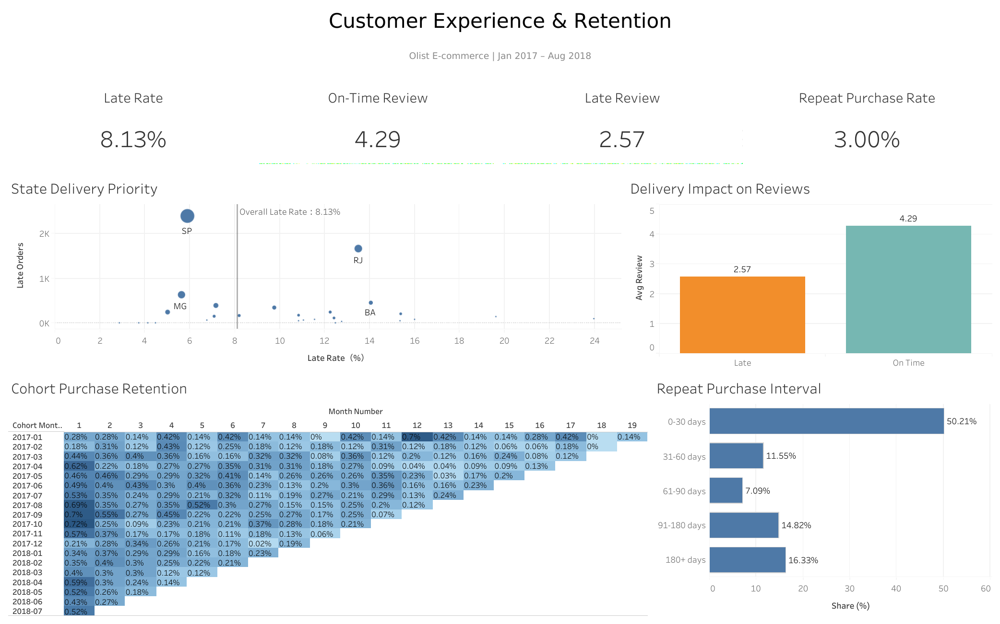

# Olist 电商经营与客户分析

> 基于 Olist Brazilian E-Commerce Dataset，使用 **MySQL + Tableau** 对约 9.6 万笔已完成订单进行分析，围绕订单数据增长、区域变化、配送体验以及客户复购率展开业务分析。

**Analysis Period：2017-01 ～ 2018-08**

---

## 项目概览

本项目围绕 Olist 电商平台的经营表现和客户行为展开，主要希望回答以下问题：

- 平台 GMV 的增长主要来自 **Orders 增长**，还是 **AOV 提升**？
- 平台交易是否存在明显的 **区域集中**？
- **配送延迟**与客户评分之间存在怎样的关系？
- 哪些 State 同时具有较大的业务规模和较严重的配送问题？
- 平台增长主要依赖 **New Customers** 还是 **Returning Customers**？
- 客户的 **Repeat Purchase** 表现如何？
- 已经产生复购的客户通常会在多久后再次购买？

---

## 核心 KPI

| Metric | Result |
| --- | ---: |
| GMV | 13.18M |
| Orders | 96,211 |
| Customers | 93,104 |
| AOV | 137.00 |
| Late Rate | 8.13% |
| Repeat Purchase Rate | 3.00% |

---

## 数据处理

原始数据包含 Orders、Customers、Order Items、Products、Sellers、Payments、Reviews 等多张关系表。

其中 `order_items`、`payments` 和 `reviews` 均可能存在：

> 一张订单对应多行记录

如果直接将这些表同时 JOIN 到 Orders，容易造成同一订单被重复展开，从而导致 GMV、订单数等指标被重复计算。

因此，本项目首先将多个一对多表预聚合至 **Order Level（一行一张订单）**，再构建统一订单分析视图。

主要数据处理包括：

- 使用 `customer_unique_id` 识别真实消费者
- 将 `order_items` 聚合至订单粒度计算 GMV
- 将 Payments 聚合至订单粒度
- 对 Reviews 进行去重处理
- 构建 Delivery Days、Delay Days 和 Late Flag
- 使用 `delivered` 订单作为核心经营分析样本
- 使用 `ROW_NUMBER()` 判断 New / Returning Orders
- 使用 `LAG()` 分析 Repeat Purchase Interval
- 使用 Cohort Analysis 分析购买留存

### 核心指标口径

**GMV**

```text
SUM(order_items.price)
```

GMV 不包含 Freight。

**AOV**

```text
GMV / Orders
```

**Late Order**

```text
Actual Delivery Date > Estimated Delivery Date
```

**Repeat Purchase Rate**

```text
Customers with 2+ Orders / Total Customers
```

---

# 核心发现

## 1. 平台增长主要由订单规模驱动

2018 年 1–8 月相比 2017 年同期：

- GMV 同比增长约 **141%**
- Orders 同比增长约 **140%**
- AOV 基本保持稳定

GMV 和 Orders 的增长幅度非常接近，而 AOV 未出现明显增长。

因此可以判断：

> **Marketplace Growth 主要由交易规模扩大驱动，而不是消费者单笔消费金额提升。**

**Growth was primarily volume-driven rather than AOV-driven.**

---

## 2. 平台业务存在明显的区域集中

SP、RJ 和 MG 是平台最主要的三个市场。

三者合计贡献约：

> **63% GMV**

其中 SP 的交易规模明显高于其他地区。

这说明平台业务对少数核心 State 存在较高依赖，在资源配置和运营风险评估时应重点关注这些地区。

---

## 3. 配送延迟与较低客户评分明显相关

配送状态不同的订单在 Review Score 上存在明显差异：

| Delivery Status | Avg Review | Avg Delivery Days |
| --- | ---: | ---: |
| On Time | 4.29 | 10.84 |
| Late | 2.57 | 31.48 |

On-Time Orders 的平均评分约为 **4.29**，而 Late Orders 仅约为 **2.57**。

同时，Late Orders 的平均配送时间明显更长。

说明：

> **配送时效与客户满意度之间存在明显关联。**

需要注意的是，本项目使用的是时间序列数据，因此该结果表示 **Association（相关关系）**，而不能直接判断二者存在严格的因果关系。

---

## 4. RJ 是更值得优先关注的配送区域

如果只按照 Late Orders 数量排序，SP 的延迟订单最多。

但进一步同时考虑：

- Orders
- Late Orders
- Late Rate

可以发现 SP 和 RJ 的问题性质不同。

### SP

- 业务规模最大
- Late Orders 数量最多
- Late Rate 约 **5.9%**
- 低于平台整体水平

### RJ

- 业务规模较大
- Late Orders 数量较高
- Late Rate 约 **13.5%**
- 明显高于平台整体 **8.13%**

因此：

> SP 的高 Late Orders 更多受到巨大订单规模影响，而 RJ 同时具有较大的业务规模和较高的延迟率，是更值得优先诊断的区域。

该分析采用：

```text
Impact   → Orders / Late Orders
Severity → Late Rate
```

即 **Impact × Severity** 的优先级判断思路，而不是单纯按照某一个指标排序。

---

## 5. 平台增长高度依赖新客

在约 **93,104** 名消费者中：

- 约 **97%** 的消费者仅购买一次
- Repeat Purchase Rate 约为 **3.00%**

从订单和 GMV 结构来看：

- Returning Orders 占比约 **3.24%**
- Returning GMV 占比约 **2.91%**

说明平台当前的交易主要来自首次购买客户。

> **Marketplace activity was heavily acquisition-driven rather than retention-driven.**

虽然复购消费者数量较少，但 Repeat / High-frequency Customers 在整个观察期内的平均单客累计 GMV 明显高于 One-time Customers。

因此，提高首次购买后的二次购买转化仍具有潜在客户价值。

---

## 6. 复购行为主要集中在首次购买后的早期阶段

在已经发生复购的订单中：

| Purchase Interval | Share |
| --- | ---: |
| 0–30 days | 50.21% |
| 31–60 days | 11.55% |
| 61–90 days | 7.09% |
| 91–180 days | 14.82% |
| 180+ days | 16.33% |

约：

> **50.21% 的复购订单发生在前一次购买后的 30 天以内。**

同时，Cohort Purchase Retention 整体处于较低水平，多数 Cohort 在后续月份的购买留存低于 1%。

因此：

> 首次购买后的前 30 天可能是二次购买激励和客户召回的重要运营窗口。

---

# Tableau Dashboard

## Dashboard 1 — Marketplace Performance Overview



Dashboard 1 主要展示：

- GMV
- Orders
- Customers
- AOV
- Monthly GMV Trend
- GMV by State
- New vs Returning Orders

主要用于回答：

> 平台业务规模如何？  
> GMV 是否持续增长？  
> 增长主要来自哪里？  
> 交易集中在哪些地区？  
> 平台增长依赖新客还是老客？

---

## Dashboard 2 — Customer Experience & Retention



Dashboard 2 主要展示：

- Late Rate
- On-Time Review
- Late Review
- Repeat Purchase Rate
- State Delivery Priority
- Delivery Impact on Reviews
- Cohort Purchase Retention
- Repeat Purchase Interval

主要用于回答：

> 配送问题是否影响客户体验？  
> 哪些区域需要优先改善？  
> 客户购买后是否会再次回来？  
> 已经复购的客户通常在什么时候再次购买？

---

## Interactive Dashboard

https://public.tableau.com/app/profile/.30981806/viz/olist_ecommerce_analysis_17892648550210/Dashboard1MarketplacePerformanceOverview

---

# 业务建议

## 1. 优先关注 RJ 的配送表现

RJ 同时具备：

- 较大的订单规模
- 较多的 Late Orders
- 明显高于平台平均水平的 Late Rate

因此，相比单纯因为订单规模大而产生较多延迟订单的 SP，RJ 更适合优先进行配送流程诊断。

---

## 2. 将配送体验作为客户满意度改善的重要方向

Late Orders 的平均评分明显低于 On-Time Orders。

平台可以进一步关注：

- 配送时效
- 预计送达时间准确性
- 高延迟地区物流能力
- 高影响品类的配送流程

从而降低配送问题对客户体验的影响。

---

## 3. 重视首次购买后的二次转化

平台当前高度依赖新客，而 Repeat Purchase Rate 较低。

在已经发生复购的订单中，约一半发生在前一次购买后的 30 天以内。

因此，可以重点关注首次购买后的早期阶段，例如：

- 二次购买优惠
- 优惠券召回
- 关联商品推荐
- 定向营销触达

前 30 天可能是一个值得重点关注的运营窗口。

---

## 4. 运营问题不应仅根据单一指标排序

例如配送问题分析中：

只看 Late Orders，容易优先选择业务规模最大的地区。

但结合：

```text
Impact + Severity
```

可以进一步区分：

- 规模导致的问题数量高
- 实际问题发生率高

从而更合理地确定运营优先级。

---

# 分析局限

本项目存在以下限制：

- Olist 为公开历史数据集，本项目不代表当前电商平台经营状况
- 主要分析时间限定为 **2017-01 ～ 2018-08**
- GMV 使用商品 `price` 计算，不包含 Freight
- Late Rate 仅基于能够判断配送状态的订单
- Category 中可能存在一张订单包含多个品类，因此 Category Orders 不可直接加总为平台总订单数
- Seller 分析中可能存在 Multi-Seller Orders
- 数据集中只有 Order-level Delivery Date，没有 Seller-level Delivery Date，因此无法直接判断某个 Seller 是否是订单延迟的唯一原因
- Review Score 与配送延迟属于可能性关联，不代表严格因果关系
- Cohort Retention 衡量的是再次购买行为，而不是 App 登录或用户活跃留存
- 后期 Cohort 的观察窗口更短，因此不能直接与早期 Cohort 进行完全等长比较

---

# Tools & Skills

## Tools

- MySQL 8
- DataGrip
- Tableau Public
- Excel

## SQL

- `JOIN`
- `LEFT JOIN`
- `GROUP BY`
- `CASE WHEN`
- `CTE`
- `ROW_NUMBER()`
- `LAG()`
- `RANK()`
- `SUM() OVER()`
- Date Functions
- Data Validation

## Analysis Methods

- KPI Analysis
- Growth Driver Analysis
- Geographic Analysis
- Customer Segmentation
- New vs Returning Analysis
- Cohort Analysis
- Purchase Interval Analysis
- Impact × Severity Analysis
- Data Quality Validation

---

# Repository Structure

```text
olist-ecommerce-analysis/
│
├── README.md
│
├── sql/
│   └── customer_analysis.sql
│
├── outputs/
│   ├── overall_kpi.csv
│   ├── monthly_kpi.csv
│   ├── state_performance.csv
│   ├── category_performance.csv
│   ├── delivery_review_summary.csv
│   ├── customer_segment.csv
│   ├── monthly_customer_type.csv
│   ├── cohort_retention.csv
│   └── purchase_gap_distribution.csv
│
├── dashboard/
│   └── olist_ecommerce_analysis.twbx
│
└── images/
    ├── dashboard_1_marketplace_overview.png
    └── dashboard_2_customer_experience_retention.png
```

---

# Data Source

**Olist Brazilian E-Commerce Public Dataset**

原始数据主要包含：

- Customers
- Orders
- Order Items
- Products
- Sellers
- Payments
- Reviews
- Product Category Translation

---

## 项目总结

本项目从原始多表数据出发，完成了：

```text
数据理解
→ 数据粒度检查
→ 多表预聚合
→ 订单级分析数据集构建
→ KPI 分析
→ 增长驱动分析
→ 配送问题诊断
→ 客户复购分析
→ Cohort Analysis
→ Tableau Dashboard
→ Business Recommendations
```

项目重点不只是展示指标，而是尝试从：

> **What happened → Why it happened → Where to focus**

的思路，将 SQL 分析结果转化为可解释的业务洞察。
